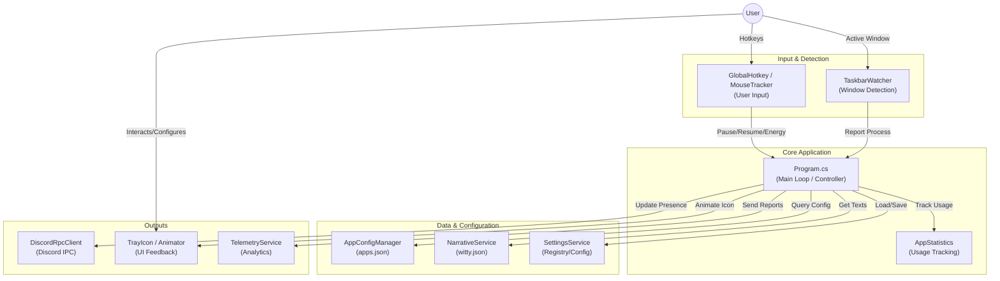

# geetRPCS Architecture Overview

This document describes the high-level architecture of **geetRPCS** (Discord Rich Presence Custom Switcher). Its purpose is to help developers understand how the application works, how data flows, and how its main components interact.

## High-Level Architecture

geetRPCS operates as a **System Tray** application running in the background. The core of the application is the main loop in `Program.cs`, which orchestrates application detection, state management, and communication with Discord RPC.



## Key Components

### 1. Core Controller (`Program.cs`)

This file is the "brain" of the application. Unlike modern .NET applications that might use complex Dependency Injection containers, geetRPCS is designed to be _straightforward_, with `Program.cs` acting as the central controller.

- **Responsibilities:**
  - Initializing all services (`DiscordRPC`, `TaskbarWatcher`, etc.).
  - Handling the _Single Instance Mutex_.
  - Managing global _State_ (`currentApp`, `isPaused`, `privateMode`).
  - Handling events from the Tray Icon and Hotkeys.
  - Updating Discord RPC based on input from `TaskbarWatcher`.

> **v1.4.0+:** `Program.cs` is now a thin host. Orchestration moved to `AppCoordinator`, `PresenceBuilder`, `TrayMenuController`, `StatsCoordinator` and `UpdateOrchestrator` (see the services below).

### 2. Services

These services handle specific logic to keep `Program.cs` clean (although currently, `Program.cs` still performs heavy orchestration).

| Service                    | Description                                                                                                                               |
| :------------------------- | :---------------------------------------------------------------------------------------------------------------------------------------- |
| **`TaskbarWatcher`**       | Monitors active window changes and taskbar events using UI Automation / WinAPI hooks. Notifies `Program.cs` when the application changes. |
| **`AppConfigManager`**     | Loads and manages the database of supported applications from `apps.json`.                                                                |
| **`NarrativeService`**     | ("Witty Service") Handles the rotation of funny/unique status texts from `witty.json` so the status doesn't become monotonous.            |
| **`TelemetryService`**     | Sends anonymous usage data (detected applications, duration) for development analysis.                                                    |
| **`UpdateChecker`**        | Checks for application updates and database updates (`apps.json`/`witty.json`) from GitHub.                                               |
| **`MouseActivityTracker`** | (Experimental) Calculates mouse movement "energy" for dynamic status features.                                                            |

The following services were added in the v1.4 line:

| Service                  | Description                                                                                           |
| :----------------------- | :---------------------------------------------------------------------------------------------------- |
| **`AppCoordinator`**     | Orchestrates app detection, state and RPC updates; validates Discord Application IDs.                 |
| **`PresenceBuilder`**    | Assembles the Discord presence payload from app config, narrative text and mouse energy.              |
| **`StatsCoordinator`**   | Tracks per-app usage statistics and handles CSV/JSON export.                                          |
| **`UpdateOrchestrator`** | Coordinates update checks, downloads and the auto-update flow together with `UpdateDownloader`.      |
| **`LanguageManager`**    | Single access point for localization: loads `Languages/*.json`, merges missing keys with `en.json`, logs a warning for every fallback (see [LOCALIZATION.md](LOCALIZATION.md)). |
| **`LogService`**         | Centralized logging with levels and rotation.                                                        |
| **`StartupTask`**        | Manages the Windows startup shortcut.                                                                |

### 3. Data Persistence

- **`config.json`**: Basic RPC configuration (default Client ID) and default text when idle.
- **`apps.json`**: Large database mapping Process Name -> Discord App ID & Assets. This file is updated frequently.
- **`witty.json`**: Collection of random sentences for Discord status.
- **`Registry / UserSettings`**: Stored via `SettingsService` for user preferences (such as `AutoStart`, `TrayAnimation`).
- **`AppStatistics`**: Stores local usage data (how long the user uses app X) for the "Today's Stats" feature.

### 4. User Interface (UI)

Since it is System Tray-based, the UI is minimalist:

- **`ContextMenu`**: Right-click menu on the tray icon (Pause, Manage Apps, etc.).
- **`TrayMenuController`**: Builds the fully localized tray menu (the old `ContextMenu` replacement).
- **`PresencePreviewForm`**: Form to view real-time preview of the Rich Presence display.
- **`ManageAppsForm`**: Interface to disable detection of specific applications.
- **`InfoDialog` / `ConfirmDialog` / `UpdateDialogs`**: Custom dark-theme dialogs replacing native message boxes.

Every user-visible string is routed through `LanguageManager`; all 24 shipped languages are complete, and a missing key falls back to English with a warning in `geetRPCS.log` (see [LOCALIZATION.md](LOCALIZATION.md)).

## Data Flow

1. **Detection**: `TaskbarWatcher` detects the user switching windows to "Visual Studio Code".
2. **Lookup**: `Program.cs` receives the process name (`Code.exe`), then asks `AppConfigManager`: "Is `Code.exe` in the database?"
3. **Assembly**:
   - If yes, retrieve custom App ID (if available) and image assets.
   - Retrieve status text from `NarrativeService` (if Witty mode is active).
   - Format the string (replace `{filename}`, `{project}`) using helpers in `Placeholders`.
4. **Execution**:
   - If the App ID changes, `DiscordRpcClient` is restarted with the new ID.
   - Call `rpc.SetPresence()` with the assembled data.
   - Trigger tray animation via `TrayIconAnimator`.

## Testing & CI

### Tests project (`Tests/`)

A dependency-free console runner — `dotnet run --project Tests` — that validates:

- **App-ID rules** – `IsValidApplicationId()` (17–20 digits, digits only).
- **apps.json integrity** – unique process names, valid client IDs, non-empty image keys, valid button URLs/labels, max 2 buttons.
- **Telemetry default** – telemetry stays ON for new installs.
- **Language parity** – every key in `en.json` must exist in every language file and `template.json`; a missing key fails the run.

The main project exposes internals to `Tests` via `InternalsVisibleTo`.

### CI pipeline (`.github/workflows/ci.yml`)

GitHub Actions builds the solution and runs the full test suite on every push to `main` and every pull request, so an invalid `apps.json` or a missing translation key fails the build before merge.

### Localization

See [LOCALIZATION.md](LOCALIZATION.md) for the architecture: `LanguageManager` is the single access point, per-file keys missing from a language fall back to `en.json` (with a `WARNING` naming them in `geetRPCS.log`), and `template.json` is the canonical English reference for translators.

## Source Folder Structure

```text
geetRPCS/
├── Program.cs           # Thin host (startup, single instance, hotkeys)
├── Models/              # Data Structures (json mapping objects)
├── Services/            # Logic Providers (AppCoordinator, PresenceBuilder, LanguageManager, ...)
├── UI/                  # Windows Forms (Preview, Manage Apps, dialogs, tray menu)
├── Utils/               # Helpers (AppPaths, GlobalHotkeys, ShortcutManager, ...)
├── Languages/           # Localization Files (.json, one per language)
├── Tests/               # Dependency-free validation runner (apps.json + language parity)
├── UpdaterHelper/       # Maintenance tool (install/update/uninstall)
├── docs/                # Extra documentation (CUSTOM_APP_ID.md, ...)
├── .github/workflows/   # CI pipeline (build + tests)
└── assets/              # Icons and Images
```
